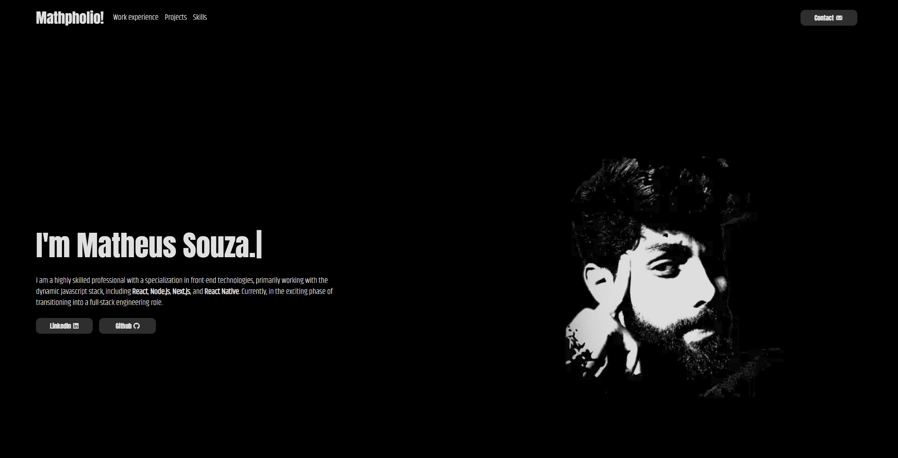

**👨‍💻 Tecnologias / Technologies**

Esse projeto foi desenvolvido com as seguintes tecnologias / This project was developed with the following technologies:

- [Next.js](https://nextjs.org/)
- [React](https://react.dev/)
- [Typescript](https://www.typescriptlang.org/)
- [TailwindCSS](https://tailwindcss.com/)
- [Vitest](https://vitest.dev/)
- [Mock Service Worker](https://mswjs.io/)
- [Husky](https://typicode.github.io/husky/)

---

**💻 Projeto / Project**

This is my personal website, visit on: https://mathpholio.vercel.app

---

📖 **Documentation** 

[https://www.notion.so/mathpholio](https://www.notion.so/Portfolio-Website-c2d58629e0204d8abaa895ec3d0996d0?pvs=4)

---

**🧑🏾‍💻 Autor / Author**

**Matheus Gomes de Souza**

LinkedIn: https://www.linkedin.com/in/matheus-gomes-de-souza/  
E-mail: matheusg_souza@outlook.com
